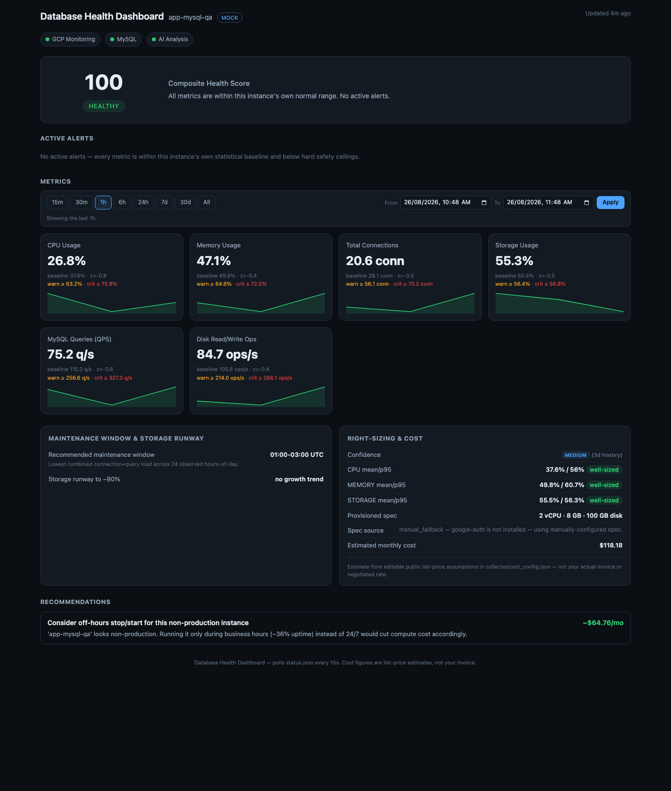
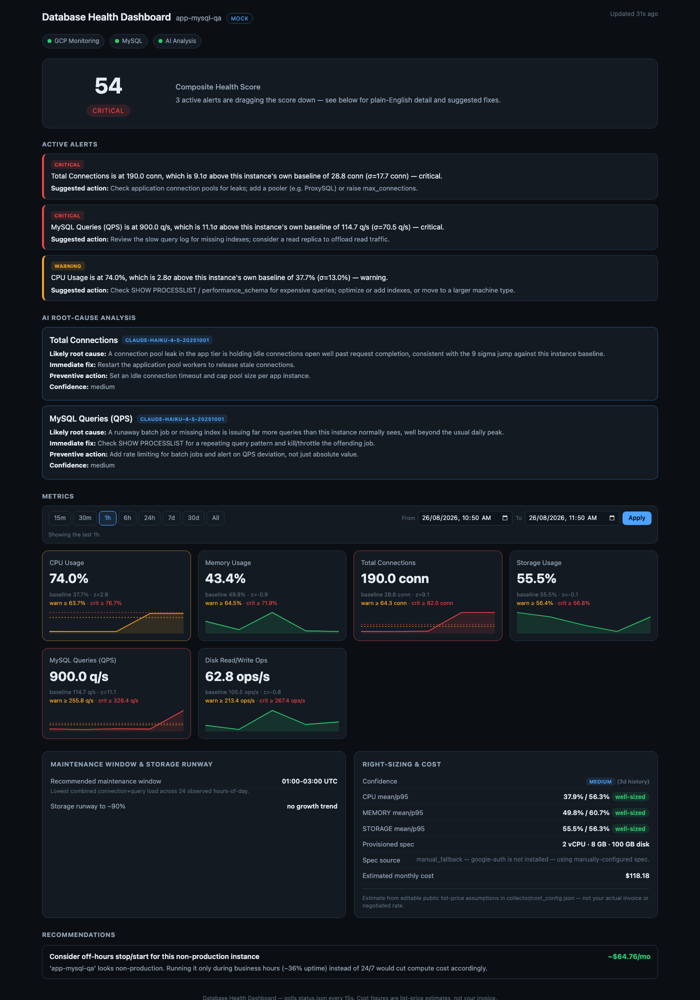

# AI-CloudSQL: Cloud SQL AI Advisor

Self-baselining anomaly detection, a health score, plain-English alerts and
cost right-sizing for a GCP Cloud SQL (MySQL) instance. Originally built in
one day at a hackathon with Claude Code, then deployed as a long-running
service on a GCP VM.

```
collector/      Python collector: polls Cloud Monitoring + MySQL, runs the analysis, serves the dashboard
src/            the dashboard (single self-contained index.html)
deploy/         GCP VM deployment kit: installer, systemd services, nginx, health check
demo/           screenshots
.env.template   placeholder config (copy to .env, which is gitignored)
```

A health dashboard for a GCP Cloud SQL (MySQL) instance that answers "is my
database okay, and if not, what do I do about it" — instead of handing you
a pile of graphs and letting you do that math yourself.

**Tracked widgets:** CPU usage, memory usage, total connections, storage
usage, MySQL queries (QPS), and disk read/write ops. (Storage capacity and
absolute disk-usage-in-GB are the same underlying signal in different
units, so only one storage widget — % of provisioned capacity — is shown,
rather than two widgets saying the same thing.)



## Why this beats the stock GCP Monitoring console

The stock console shows you graphs. This computes a diagnosis.

1. **Self-baselining anomaly detection, not just fixed thresholds.**
   Every metric gets its own rolling mean/stddev baseline for *this*
   instance. A value is flagged by z-score (≥2σ warning, ≥3σ critical) as
   well as by a hard ceiling (used only as a cold-start floor, e.g. CPU
   ≥75%/≥90%). That means 74% CPU can be flagged **critical** because it's
   3.9σ above what's normal for this specific instance — long before a
   naive fixed-threshold rule would even reach "warning" at 75%. Two
   instances with wildly different normal loads get wildly different
   alert points, correctly.

2. **One composite health score (0-100)**, weighted by which metrics are
   in alert and how severely, instead of several graphs to mentally fuse.

3. **Alerts are sentences, not metric names.** "CPU usage is at 74.0%,
   which is 2.8σ above this instance's own baseline of 37.4% (σ=13.1%) —
   warning" plus one concrete suggested fix — not "CPU: WARN".

4. **Every widget shows its own live limit, not just a value.** Each
   metric card displays the actual number that would trip the next
   warning/critical alert *right now* — the more sensitive of the fixed
   hard ceiling and this instance's own `mean + 2σ`/`mean + 3σ` — as text
   and as dashed threshold lines drawn directly on its sparkline, so you
   can see at a glance how close the trend is to tripping an alert.

5. **A time-range picker per the whole metrics panel**: quick buttons
   (15m/30m/1h/6h/24h/7d/30d/All) plus a calendar/time "From"–"To" picker
   for any custom window, filtering every widget's graph at once — instead
   of a single fixed lookback window like the stock console.

6. **A maintenance panel** that mines your own traffic history for the
   actual lowest-load hours (not a guess), and forecasts storage runway
   via linear regression, telling you the date by which you need to act if
   the storage-increase window is closing.

7. **Long-term right-sizing and cost estimation**, using your real
   provisioned spec pulled from the Cloud SQL Admin API (or a manual
   fallback), classified against 30 days of actual p95/mean usage, with
   concrete recommendations and *estimated* dollar impact — clearly
   labeled as list-price assumptions, never claimed as your real invoice.
   Confidence is explicitly low/medium/high based on how much history has
   actually been collected.

8. **AI root-cause analysis**, only when there's something to diagnose,
   using this instance's actual numbers and spec — not generic advice.
   Optional, cached, and cheap (see [Model choice](#model-choice)).



*(The AI panel in this screenshot uses a representative response — no
Anthropic API key was available in the build sandbox to make a live call.
The request path itself was verified end-to-end, including a live call to
`api.anthropic.com` that correctly failed and was caught on an invalid key.)*

## Architecture

A browser can't speak the MySQL wire protocol and shouldn't hold cloud
credentials — so this is two pieces:

```
collector/   Python. Polls GCP Cloud Monitoring + MySQL directly (or
             generates synthetic data in --mock mode), runs all the
             analysis, writes src/status.json. Can also serve src/ over
             HTTP so the whole thing is one command.

src/         A single self-contained index.html — no build step, no
             external chart libraries (the sparklines are hand-rolled
             canvas). Polls status.json every 15s. If that fetch fails
             (collector not running yet, or opened via file://) it falls
             back to embedded placeholder data instead of a blank screen.
```

Every data source — GCP Cloud Monitoring, direct MySQL, AI analysis — is
independent and fails independently: if GCP auth is broken but MySQL is
reachable, you still get connections/QPS with CPU/memory marked
"unavailable" and a plain-English reason, and vice versa. Nothing that
fails in one source can crash the collector process or affect another
source (verified — see [Verification](#verification)).

## Quick start (zero setup)

```bash
python3 collector/collector.py --mock --serve
```

Open `http://127.0.0.1:8000/`. No dependencies, no cloud access, no
database — pure standard library. Mock mode generates a daily usage curve
with noise.

To see the alerting state:

```bash
python3 collector/collector.py --mock --serve --mock-anomaly cpu,connections
```

`--mock-anomaly` takes a comma-separated list of any of: `cpu`, `memory`,
`connections`, `storage`, `qps`, `disk_io`.

In the dashboard, use the time-range bar above the metrics grid (15m
through 30d, "All", or a custom "From"/"To" calendar range) to control how
much history each widget's graph shows — this only affects the graphs, not
the current value/limit shown above them. A short range like 15m will show
"not enough data points" until the collector has polled a few times at
that resolution; widen the range or lower `POLL_INTERVAL_SECONDS` to see
more.

## Running against a real instance

1. `cp .env.template .env` and fill in your project/instance/MySQL
   credentials. **`.env` is gitignored — never commit it.**
2. `pip install -r collector/requirements.txt` (only needed for real mode —
   mock mode needs nothing beyond the standard library; every real
   dependency is imported lazily and its absence degrades only that one
   source).
3. `python3 collector/collector.py --serve`

The collector needs:
- **GCP Cloud Monitoring** (`roles/monitoring.viewer`) for CPU, memory,
  storage %, disk bytes, and disk read/write ops.
- **Direct MySQL access** (e.g. via the Cloud SQL Auth Proxy on
  `127.0.0.1`) for `SHOW GLOBAL STATUS`/`SHOW GLOBAL VARIABLES` — total
  connections and QPS (computed as a delta between polls; the first poll
  after a restart correctly has no QPS yet rather than reporting `0`).
- **Cloud SQL Admin API** (`roles/cloudsql.viewer`), optional — resolves
  the real provisioned spec (vCPU/memory/storage/HA). Falls back to
  `INSTANCE_*` values in `.env` if unreachable.
- **`ANTHROPIC_API_KEY`**, optional — enables Requirement 6. Everything
  else works with it blank.

## Deploying on a GCP VM (long-running, behind a password)

`deploy/` turns the collector into a production-style service on an Ubuntu
22.04/24.04 GCP VM:

```
Browser -> nginx :80/:443 (basic auth) -> collector.py --serve on 127.0.0.1:8000
                                            -> Cloud SQL Auth Proxy on 127.0.0.1:3306 -> Cloud SQL
                                            -> Cloud Monitoring / Cloud SQL Admin API via the VM's service account
```

Upload `collector/`, `src/` and `deploy/` to the VM, then:

```bash
cp deploy/env.vm.template .env && nano .env    # project, instance, MySQL user
nano deploy/deploy.conf                        # Cloud SQL connection name, private IP or not
sudo bash deploy/install.sh
```

`install.sh` installs the packages and creates a `dbdash` system user. It
sets up the `cloud-sql-proxy`, `dbdash` and `nginx` services (all enabled at
boot), runs one live collection cycle, and prints OK/FAIL for each data
source. `bash deploy/check.sh` repeats that check any time. Use it rather
than the health score, which reads 100 when no metrics are available at
all. The full walkthrough with expected output is in
[`deploy/DEPLOY_STEPS.md`](deploy/DEPLOY_STEPS.md). No key file is needed:
the VM's service account needs `roles/monitoring.viewer`,
`roles/cloudsql.viewer` and `roles/cloudsql.client`.

## Changes since the hackathon version

- **Disk read/write ops are now per second.** Cloud SQL's `disk/read_ops_count`
  and `disk/write_ops_count` are DELTA metrics (operations per 60 s sample).
  Earlier they were shown raw as "ops/s", about 60x too high. They're now
  divided by each point's sample window.
- Added the `deploy/` kit above.

## Model choice

Root-cause diagnosis here is a bounded, low-reasoning task: classify a
handful of already-computed structured values (metric, value, baseline,
z-score, provisioned spec) into a root cause, an immediate fix, a
preventive action, and a confidence level — not open-ended reasoning over
an unbounded problem. So the collector defaults to **Claude Haiku**
(`claude-haiku-4-5-20251001`), the fastest/cheapest current model, and asks
for a tool-forced, JSON-schema-constrained response so the result is always
parseable. It's overridable via `ANTHROPIC_MODEL` in `.env` for anyone who
wants a stronger model for harder diagnosis. Results are cached in-memory
per unique combination of (metric, severity) across active alerts for
`AI_CACHE_TTL_SECONDS` (default 300s), so a steady alert state doesn't
re-call the API every poll cycle.

## Cost estimates are assumptions, not your invoice

`collector/cost_config.json` holds editable, clearly-labeled public
list-price numbers (`_disclaimer` field spells this out). Edit them to
match your actual region/contract for a more accurate estimate — the
dashboard always presents figures derived from them as estimates.

## Verification

This was checked beyond "the code reads correctly":

- `python3 -m py_compile` on every collector module.
- Each of the three independent data sources (GCP Monitoring, MySQL, AI)
  was driven through its actual failure path — missing config, missing
  dependency, connection refused, and an invalid API key producing a real
  401 from `api.anthropic.com` — and confirmed to degrade only itself
  without raising.
- The statistical-vs-hard-ceiling anomaly logic was unit-checked against
  the exact scenario from the spec: 74% CPU against a baseline of
  mean=45%/σ=7.5% computes to z=3.87 → **critical**, while the hard
  ceiling alone (≥90%) would not have fired at all.
- A real `history.jsonl` was built (3 days of synthetic samples) and run
  through the full collector to confirm baselines, the maintenance-window
  hour-of-day mining, the storage-runway regression, and the 30-day
  right-sizing classification all produce sane, non-crashing output — this
  is also how an ordering bug was caught and fixed (`history.load_history`
  now explicitly sorts by timestamp rather than trusting append order,
  since analysis code assumes chronological order for span/regression math).
- The dashboard was rendered in headless Chrome and screenshotted in three
  states: healthy/zero-alerts (`demo/healthy.png`), critical/multi-alert
  with AI analysis and cost recommendations populated
  (`demo/alerting.png`), and the embedded-placeholder fallback with no
  `status.json` present at all (confirmed it renders a full demo dashboard
  with a visible banner, not a blank page).
- The time-range picker was driven end-to-end via the Chrome DevTools
  Protocol (clicking the quick-range buttons and typing into/submitting
  the calendar "From"/"To" inputs, not just reading the code) and
  confirmed each widget's graph and active-range label actually change,
  including the correct "not enough data points in this range yet"
  fallback for a 15-minute window narrower than the poll interval.
- A stale background collector process from an earlier test run was caught
  live-appending old-schema samples (still including the removed
  `disk_usage` field) into `history.jsonl` mid-verification — a good
  reminder that a long-running collector holds its code in memory across
  edits. Killed it and rebuilt history from a clean process.

## Repo layout

```
README.md              this file
deploy/                 GCP VM deployment kit (see above)
demo/                    screenshots: healthy.png, alerting.png
src/
  index.html             the dashboard (self-contained, no build step)
  status.json            generated by the collector at runtime (gitignored)
collector/
  collector.py           entry point: polling loop, HTTP serving, CLI
  config.py               env loading + metric metadata (weights, thresholds, actions)
  history.py               30-day rolling sample storage
  analysis.py               Requirements 1-5: anomaly detection, scoring, alerts,
                             maintenance/runway, right-sizing/cost
  sources.py                GCP Monitoring, MySQL, Cloud SQL Admin API — each
                             independently fails without crashing the others
  mock.py                    synthetic data generator with injectable anomalies
  ai_analysis.py             Requirement 6: optional, cached, Haiku-by-default
  cost_config.json           editable public list-price assumptions
  requirements.txt           pymysql / google-cloud-monitoring / google-auth
                             (only for real mode; lazily imported)
.env.template            placeholder config, safe to commit
.gitignore               excludes .env and all generated runtime data
```
